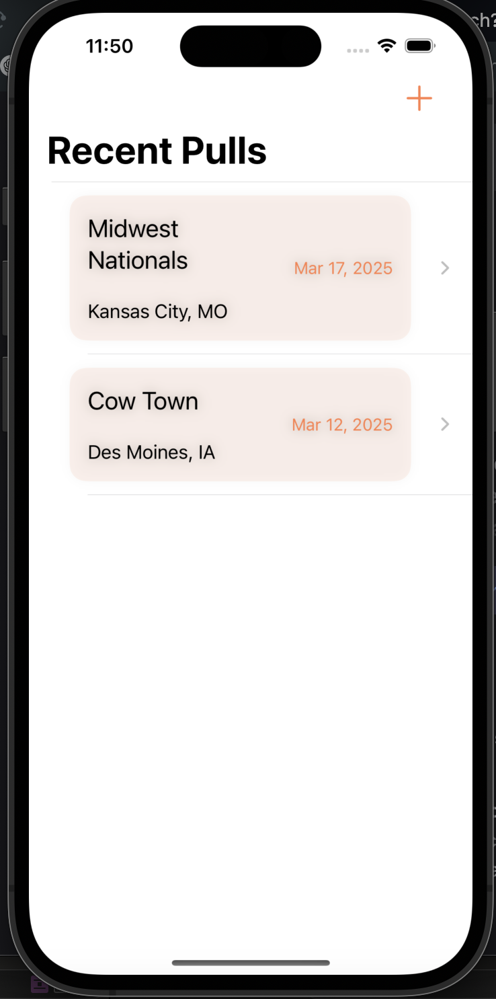
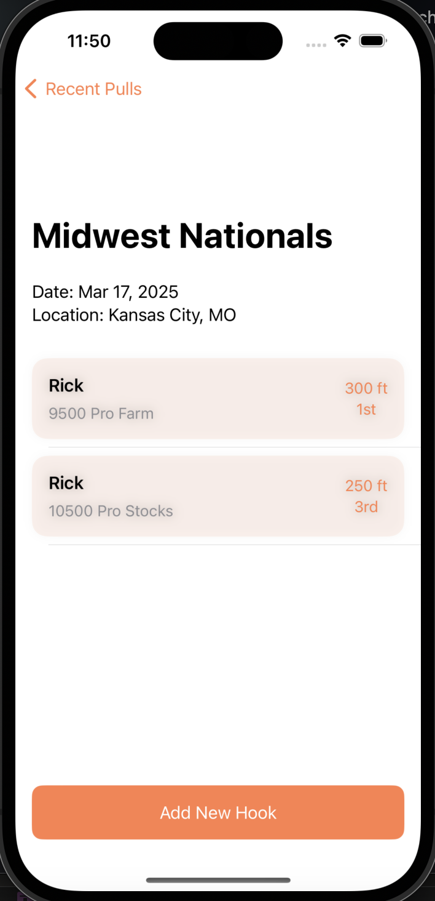
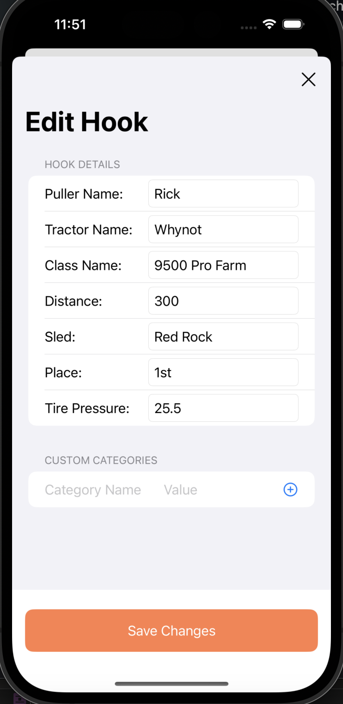
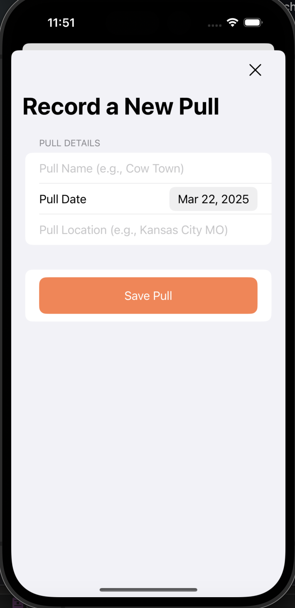
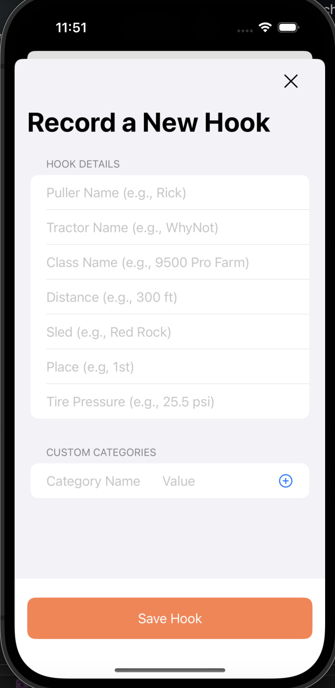

# Data-Driven Pulls
[The App in Action](Assets/Screen Recording 2025-02-15 at 4.50.34 PM.mov)

## Purpose
I created this project because my dad is passionate about tractor pulling. He currently tracks detailed stats about each event in his iPhone's notes app, but I wanted to provide him with a more structured and efficient way to organize this data. Additionally, I saw this as an opportunity to explore mobile development. This project ultimatly didnt make it onto the app store due to the cost of the apple developer account and not having the bandwidth at this time to support monitzing the app. Maybe one day ill return to this project to finish it and maybe add some AI/ML since this project is centered around data.

## Project Description
The goal of this project was to build an app that helps my dad organize his tractor pull records. I initially planned for it to be a simple CRUD application. I chose SwiftUI because, at the time of development, it was Apple's latest framework. I also wanted to gain experience with declarative programming. As a bonus, SwiftUI's adaptive layout capabilities made it easier to support all screen sizes.

## Views
There were only 4 view that I had to design for this mobile application. The home view, detialed pull view, and both the insert views for entering a pull and entering a hook.(for people not familiar with tractor pulling a hook is one run down the track, at many of these tractor pulling events you have multipls "hooks" down the track

### The Home View
The view has 3 functions the user is able to do. The can add a new pull with the plus button in the top right. They can click on the pull itself to take them to the detailed pull screen. They can also swipe right to delete the pull.

### Detailed Pull View
This view also has 3 main funcitons. They can add a new hook by clicking the button. They can also slide to delete and click the hook to edit it.

   

 ### Insert Views
 Both of these views are simple form views that allow the user to input their data into it.

    
