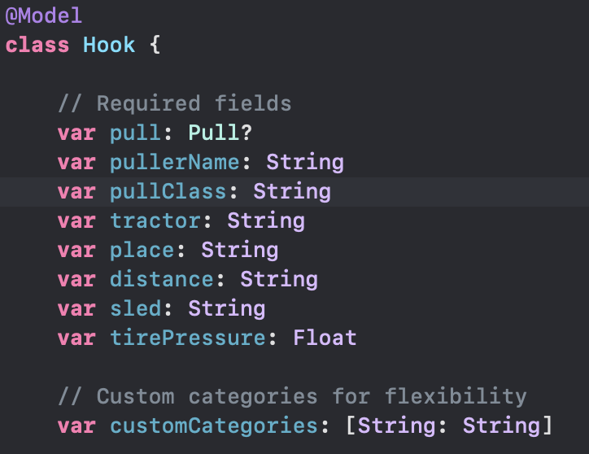

# Data-Driven Pulls
[📽 The App in Action](Assets/Demo.mov)

## Table of Contents
- [Purpose](#purpose)
- [Project Description](#project-description)
- [Views](#views)
  - [Home View](#home-view)
  - [Detailed Pull View](#detailed-pull-view)
  - [Insert Views](#insert-views)
- [Data](#data)

## Purpose
I created this project because my dad is passionate about tractor pulling. He currently tracks detailed stats about each event in his iPhone's Notes app, but I wanted to provide him with a more structured and efficient way to organize this data. Additionally, I saw this as an opportunity to explore mobile development.  

This project ultimately didn’t make it onto the App Store due to the cost of the Apple Developer Program and my limited bandwidth to support monetizing the app. Maybe one day, I’ll return to this project to finish it and potentially add AI/ML, since the project is centered around data. I would also implement **CloudKit** so users could access their data on any device, as long as they are logged into their Apple account. (I didn’t already do this because an Apple Developer account is required.)

## Project Description
The goal of this project was to build an app that helps my dad organize his tractor pull records. I initially planned for it to be a simple **CRUD application**.  

I chose **SwiftUI** because, at the time of development, it was Apple's latest framework. I also wanted to gain experience with **declarative programming**. As a bonus, SwiftUI's **adaptive layout** capabilities made it easier to support all screen sizes.

## Views
This mobile application consists of four main views:
1. **Home View** – The main screen for managing pulls.
2. **Detailed Pull View** – Displays details for a selected pull.
3. **Insert Pull View** – Used to add a new pull.
4. **Insert Hook View** – Used to add a hook (a single run down the track).  

> **Note**: In tractor pulling, a **hook** refers to a single run down the track. Many events allow multiple hooks per tractor.

### Home View
This view allows the user to:
- **Add** a new pull using the ➕ button in the top-right corner.
- **Select** a pull to view its details.
- **Swipe right** to delete a pull.

### Detailed Pull View
This view provides three main functions:
- **Add** a new hook by clicking the button.
- **Edit** a hook by selecting it.
- **Swipe to delete** a hook.

   

### Insert Views
Both views are simple forms that allow the user to input data.

    

## Data
I used **SwiftData** to ensure data persistence in the app. The data model follows a **one-to-many relationship**, where:
- Each **pull** can have multiple **hooks**.
- Each **hook** must belong to a **pull**.

This structure was straightforward to implement, as shown below:

  

## Early Designs
These are some early sketches from when I came up with the idea of making this app. I didn't want to make overly complecated wireframe sketches for this project. I knew I was gonna be using SwifUI so I wanted to adapt the design that would be provided by apple. I still wanted some personal touch to the app so I made some custom stuff like the individual pull component and hook component.

  

### Future Improvements
If I revisit this project, I’d consider:
- Implementing **AI/ML** features using **Apple Intelligence** or integrating **Firestore** to build my own model.
- Adding **CloudKit** support for seamless data sync across devices.

---
